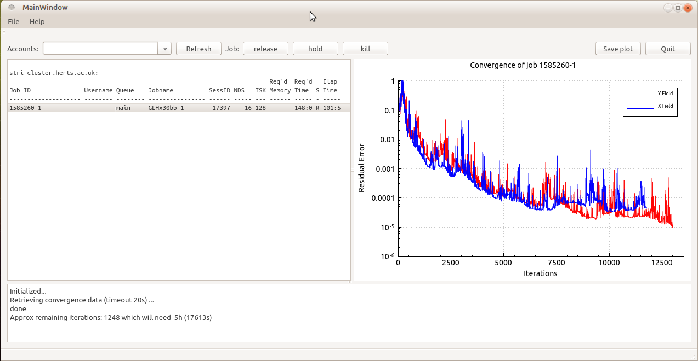

# AddaJobmonitor
A Qt client to monitor and manage ADDA runs locally and remotely.

## What is it?
A Qt GUI based runtime control and supervision for Adda(1) jobs running remotely 
on a cluster, or plain Linux machine or, locally on Windows or Linux. 

[(1) Adda](https://github.com/adda-team/adda])

## Supported systems
Monitoring works for local or remote Linux machines and clusters that run a Torque resouce manager and
understand commands such as `qstat`, `qhold` etc.  Remote machines (only non Windows) are accessed via
an external ssh so a working version needs to be installed on the local system (Putty on Windows, OpenSSH 
on Linux).

## Installation
No binary releases are provided for now, you need to compile from source, using the system supplied Qt or
an installation from here: [https://www.qt.io/download-eval-for-applications-step-2/](https://www.qt.io/download-eval-for-applications-step-2/)

### All platforms
A file `addamachines.txt` needs to be placed in the directory of the binary. It contains one account per line, as
well as the keyword `localhost`.

Example:
addamachine.txt
```
localhost
user0@my-cluster.world.com
user22@mylinuxbox.uni.com
```

### Linux
Provided Qt development packages are installed, which on Ubuntu are
`sudo apt-get install qt5-default qttools5-dev-tools`, you can compile with:

```
qmake
make
```
in the `src/`.


### Windows
Using a Qt SDK for Windows, MinGW works well

The Windows version finds currently open log files via file handles of the adda jobs running. Because there is
no easy way to do this, an external tool is invoked: you need a copy of handle.exe and place it into the system
wide search path (C:\WINDOWS is good for example).

Get handle.exe or handle64.exe from here: https://technet.microsoft.com/en-us/sysinternals/handle.aspx[https://technet.microsoft.com/en-us/sysinternals/handle.aspx]
Windows XP: The handle.exe published on the above link no longer works on win XP. You need an older version of the handle.exe binary (->Google).


## Remote Access
To avoid any security implications when using the job manger, remote access is 'outsourced' to a platform provided Secure Shell installation (OpenSSH [www.openssh.com] for example), no passwords are stored or managed inside the code. Instead, you need to have password less access for every remote account you want to use set up. Commands such as:

`ssh user0@my-cluster.world.com echo "Hello"`

must execute correctly on the remote target without locally entering a password from your terminal. This can be achieved by configuring key based logins. See the man page for ssh-copy-id and ssh-add and your Linux distribution's way of registering ssh keys for a session (you only need to type in a passphrase once per session). Never generate ssh keys without passphrase. In brief you generate ssh keys with ssh-keygen, add the public key to the remote .ssh/authorized_hosts (check file permissions in case you have created it yourself and it does not work) file or use ssh-copy-id to automate it. You then want to register your private key with the current user session in order you only need to enter its passpharse once. ssh-add or a distribution specific method is used for this. 

On Windows hosts the job manager relies on an installation of PuTTY ([www.putty.org](http://www.putty.org) and its plink command (which per default is in the system wide search PATH) to communicate. Also here password less access for the specified remote accounts (using Pageant in this case) needs to be set up and work correctly before starting the job manager. In brief, you use PuTTYgen to generate a key pair, add it to the .ssh/authorized_hosts file and register the key with Pageant prior to starting the job manager. 

## Usage
It relies on correct capturing of the standard output channels of the jobs. The jobmanager will locate and subsequently display the staus of a running job using these output files (see section below). The main focus and best tested platform is the job manager running on Linux and connecting to a cluster that has a Torque resource manager (or understands commands qstat, qhold, qdel and qrls) via password less ssh. 


## Capturing ADDA's output
File system caching may delay information getting written to disk, so convergence information might only become available after some time. 

### Linux without Torque resource manager
The monitor will find the PID and the working directory (using pwdx), it the looks for a file 
out-nnnnnn, containing Adda's standard output. To capture this, start Adda in a wrapper shell script, for bash:

```
#!/bin/bash
exec /opt/adda13b4/src/seq/adda -grid 90 > out-$$
```

### Machines with Torque scheduler
The monitor will look for a adda jobs in the queue belonging to you and the retrieve its `$PBS_O_WORKDIR` and look for a file `out-$PBS_JOBID` there. A job submission script should include a std out redirection to 
`$PBS_O_WORKDIR\out-$PBS_JOBID`, such as: 

```
/usr/local/bin/mpiexec $ADDABINARY  >  $PBS_O_WORKDIR/out-$PBS_JOBID
```

### Windows
The monitor uses the external tool handle.exe to find the open log file beloning to a adda task and then display its content. 
 
## GUI



By selecting a machine (from the list given in the addamachines.txt file) from the accounts drop down menu the current jobs are displayed on the left side. Clicking on a job will retrieve its environment and read and parse the output files and display results on the right.

The buttons [kill], [release], and [hold] invoke the equivalent commands on the job highlighted by the cursor (qdel, qrls, qhold for Torque). 

The [Refresh] button, re-retrieves the job information. To change the displayed machine, use the 'Accounts' dropdown menu.

The timeout for ssh commands is 20s, on busy cluster head nodes this sometimes leads to failing ssh commands. In this case try repeating them, by re-clicking. Also be aware that some administrators have a rate-limited ssh logins, currently ssh commands are rate limited. 

The [Save plot] button allows to save the convergence plots into a PDF file.


### Development platforms
Or known to work:

- QtCreator 2.7.2, based on Qt 5.1.0 (32bit, MinGW 4.8), Win 7 (32bit)
- QtCreator 3.0.1, based on Qt 5.2.1 (gcc 4.8.2, 64bit), Ubuntu 14.01

# License
GPLv3
Uses: QCustomplot for plotting:  http://www.qcustomplot.com/,  Version: 2.0.0-beta, Autor: Emanuel Eichhammer, Version 2.0.0-beta, GPLv3


